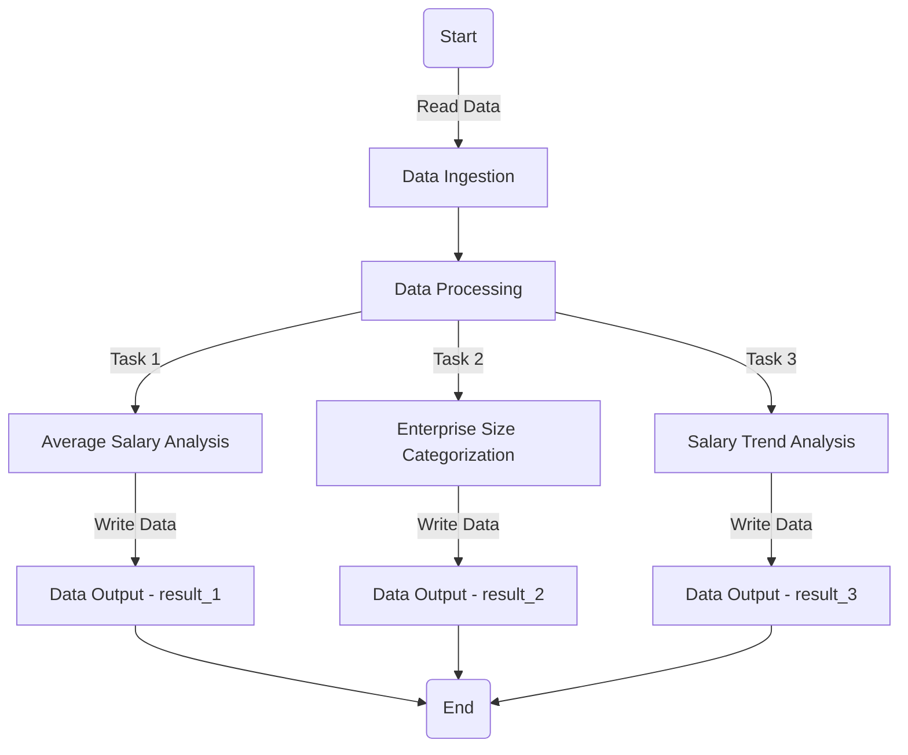

# Data Scientist Salaries Analysis

## Overview

This project aims to analyze data scientist salaries using Apache Spark, a powerful open-source unified analytics engine for large-scale data processing and machine learning. We delve into a dataset containing salary information of data scientists based on various parameters like experience level, employment type, job title, and geographical location.

The goal is to provide insights into average salaries, categorize companies by size, and identify salary trends based on job titles and locations.

## Problem Statement
The dataset, ds_salaries.csv, includes details such as work year, experience level, employment type, job title, salary, and company size. The primary objectives are:

1. **Average Salary Analysis**: Calculate the average salary for each job title for employees residing in the US and Canada, ensuring the output does not contain decimal points.
2. **Enterprise Size Categorization**: Create a new field, Enterprise_size, based on the company size, categorizing companies into Large, Medium, Small, or Others.
3. **Salary Trend Analysis**: Identify jobs where the employee's residence matches the company location and the salary is greater than $50,000, then count the occurrences of each job title.

## Tools and Technologies
* **Apache Spark**: Used for data processing and analysis. Spark's in-memory computation capabilities make it ideal for handling large datasets efficiently.
* **PySpark**: The Python API for Spark, utilized for writing Spark jobs in Python.

## Solution Approach
### Reading Data
The data is read from a CSV file using PySpark's DataFrame API, which allows for efficient handling of structured data.

### Data Processing and Analysis
1. **Average Salary Analysis**: The data is filtered for employees in the US and Canada, and the average salary is calculated for each job title using the groupBy and agg functions.
2. **Enterprise Size Categorization**: A new column, Enterprise_size, is created using conditional expressions to categorize each record based on the company size.
3. **Salary Trend Analysis**: The dataset is filtered to find records where the employee's residence matches the company location and the salary is greater than $50,000. The occurrences of each job title are counted using the groupBy and count functions.

### Writing Results
The results of each analysis are written back to CSV files, ensuring that the output is easily accessible and interpretable.

## How to Run
1. Ensure Apache Spark and PySpark are installed and configured on your system.
2. Open a terminal and navigate to the project directory.
3. Run the Spark job using the command:

```shell
spark-submit Data_Sc_Salaries.py
```

4. Check the output directories for the results.

## Solution Overview

## High-Level Architecture
1. **Data Ingestion** : Read the ds_salaries.csv file using Spark's DataFrame API.
2. **Data Processing** :
    - Task 1: Compute the average salary by job title for employees in the US and Canada.
    - Task 2: Categorize companies based on size and add the Enterprise_size field.
    - Task 3: Analyze salary trends for job titles with specific conditions.
3. **Data Storage** : Store the processed data into CSV files for each task, ensuring the data is accessible for further analysis or reporting.

## Detailed Steps
1. **Initialize Spark Session**: Set up the Spark environment and create a Spark session to manage the application.
2. **Read Data**: Utilize PySpark to load the dataset into a Spark DataFrame.
3. **Data Analysis**:
    - Implement functions to perform the specified analyses and transformations on the data.
    - Use Spark SQL and DataFrame API for data manipulation.
3. **Write Results**: Output the results of each analysis to separate CSV files, making sure the data is neatly organized and easy to interpret.

## Conclusion
This project showcases the power of Apache Spark in processing and analyzing large datasets efficiently. Through this challenge, we demonstrate how to perform data aggregation, filtering, and transformation operations to extract meaningful insights from salary data.

