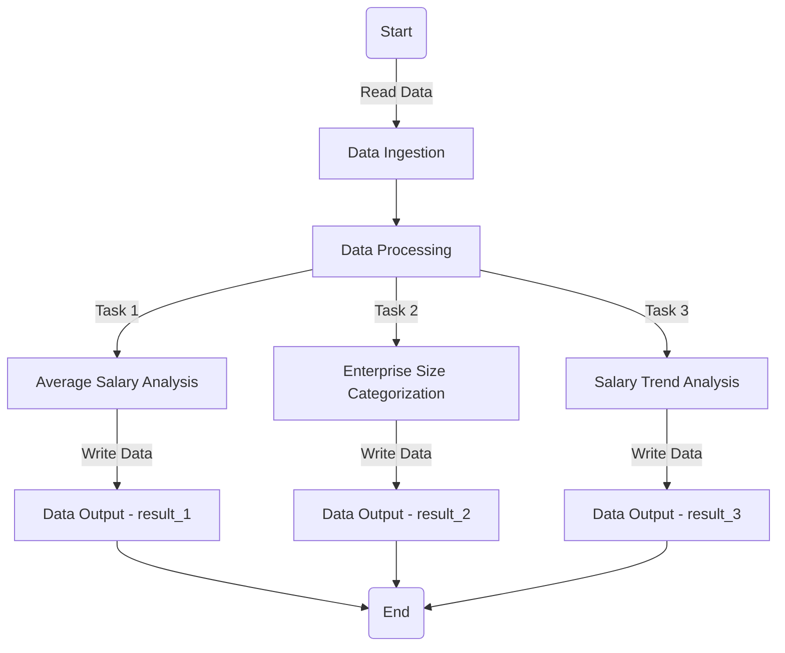

# Data Scientist Salaries Analysis

## Overview

This project aims to analyze data scientist salaries using Apache Spark, a powerful open-source unified analytics engine for large-scale data processing and machine learning. We delve into a dataset containing salary information of data scientists based on various parameters like experience level, employment type, job title, and geographical location.

The goal is to provide insights into average salaries, categorize companies by size, and identify salary trends based on job titles and locations.

## Problem Statement
The dataset, ds_salaries.csv, includes details such as work year, experience level, employment type, job title, salary, and company size. The primary objectives are:

1. **Average Salary Analysis**: Calculate the average salary for each job title for employees residing in the US and Canada, ensuring the output does not contain decimal points.
2. **Enterprise Size Categorization**: Create a new field, Enterprise_size, based on the company size, categorizing companies into Large, Medium, Small, or Others.
3. **Salary Trend Analysis**: Identify jobs where the employee's residence matches the company location and the salary is greater than $50,000, then count the occurrences of each job title.

## Tools and Technologies
* **Apache Spark**: Used for data processing and analysis. Spark's in-memory computation capabilities make it ideal for handling large datasets efficiently.
* **PySpark**: The Python API for Spark, utilized for writing Spark jobs in Python.

## Solution Approach
### Reading Data
The data is read from a CSV file using PySpark's DataFrame API, which allows for efficient handling of structured data.

### Data Processing and Analysis
1. **Average Salary Analysis**: The data is filtered for employees in the US and Canada, and the average salary is calculated for each job title using the groupBy and agg functions.
2. **Enterprise Size Categorization**: A new column, Enterprise_size, is created using conditional expressions to categorize each record based on the company size.
3. **Salary Trend Analysis**: The dataset is filtered to find records where the employee's residence matches the company location and the salary is greater than $50,000. The occurrences of each job title are counted using the groupBy and count functions.

### Writing Results
The results of each analysis are written back to CSV files, ensuring that the output is easily accessible and interpretable.

## How to Run
1. Ensure Apache Spark and PySpark are installed and configured on your system.
2. Open a terminal and navigate to the project directory.
3. Run the Spark job using the command:

```shell
spark-submit Data_Sc_Salaries.py
```

4. Check the output directories for the results.

## Solution Overview

## High-Level Architecture
1. **Data Ingestion** : Read the ds_salaries.csv file using Spark's DataFrame API.
2. **Data Processing** :
    - Task 1: Compute the average salary by job title for employees in the US and Canada.
    - Task 2: Categorize companies based on size and add the Enterprise_size field.
    - Task 3: Analyze salary trends for job titles with specific conditions.
3. **Data Storage** : Store the processed data into CSV files for each task, ensuring the data is accessible for further analysis or reporting.

## Detailed Steps
1. **Initialize Spark Session**: Set up the Spark environment and create a Spark session to manage the application.
2. **Read Data**: Utilize PySpark to load the dataset into a Spark DataFrame.
3. **Data Analysis**:
    - Implement functions to perform the specified analyses and transformations on the data.
    - Use Spark SQL and DataFrame API for data manipulation.
3. **Write Results**: Output the results of each analysis to separate CSV files, making sure the data is neatly organized and easy to interpret.

## Data_Sc_Salaries.py explanation: 

### Libraries Explanation
* ***os***: This module provides a way to use operating system-dependent functionality like reading or writing to a filesystem. It's used here for path manipulations (e.g., os.getcwd(), os.path.isdir()).
* ***shutil***: Offers high-level operations on files and collections of files. In this context, it's used for removing the output directory (shutil.rmtree()) if it already exists to ensure a fresh start.
* ***pyspark***: The root package for Apache Spark's Python API, PySpark, which provides Spark's core functionality.
* ***from pyspark.sql import SparkSession***: SparkSession is the entry point to programming Spark with the Dataset and DataFrame API. It's used to create a Spark session.
* _from pyspark.sql.functions import *_ : Imports all SQL functions like round(), avg(), which are used for data manipulation.
* ***import pyspark.sql.functions as F***: This import statement is similar to the above but allows accessing the functions with the prefix F (e.g., F.avg()). It's not explicitly used in the provided code but is useful for namespacing and avoiding naming conflicts.
* ***from pyspark.sql.types import StructType, StructField, StringType, IntegerType, FloatType, DateType***: These imports are for defining schemas for DataFrames. Although the schema definition is not directly used in the provided snippets, they're essential when you need to explicitly specify the structure of your data.

### Code Explanation
* ***read_data Function***
    Initializes reading of a CSV file into a DataFrame with headers and inferred schema. This is the first step in data processing, allowing further manipulation     and analysis.
* ***load_data Function***
    Checks if the DataFrame is not empty and writes it to a specified path as a CSV file. It uses coalesce(1) to ensure the output is a single CSV file, which is     useful for small datasets or when a consolidated file is required.
* ***result_1 Function***
    Filters the input DataFrame for records where the employee resides in the US or Canada, then calculates the average salary by job title, rounds it to the         nearest whole number, and sorts by job title.
* ***result_2 Function***
    Adds a new column, Enterprise_size, based on the company size with a CASE statement. It showcases how to perform conditional logic in Spark SQL.
* ***result_3 Function***
    Filters the DataFrame for records where the employee's residence matches the company location and the salary is greater than 50,000. Then, it counts the         occurrences of each job title, showcasing filtering and aggregation.
* ***main Function***
    Orchestrates the execution flow: cleaning up the output directory, creating a Spark session, reading the input data, processing it through various functions,     and finally writing the output to CSV files.
* ***outputfile_cleanup Function***
    Ensures a clean working directory by removing the existing output directory and creating a new one. This is crucial for rerunning the script without manual         cleanup.

## CRC Files Explanation in the output folder
When Spark writes data to a file system, it also creates CRC (Cyclic Redundancy Check) files alongside the actual data files. These CRC files, such as ._SUCCESS.crc and .part-00000-...csv.crc, are checksum files used to detect errors in the written data files. They help in ensuring data integrity by allowing Spark (or the underlying file system) to verify that the data has not been corrupted during the write process.

***._SUCCESS.crc***: A checksum file for the _SUCCESS file, which Spark creates in the output directory to indicate that the data was written successfully.
***.part-00000-...csv.crc***: Corresponds to the checksum of the actual data part file written by Spark. Each part file will have its associated CRC file.
These files are not needed for data analysis but are crucial for maintaining data integrity, especially in distributed computing environments where data is written and read across multiple nodes.

## Conclusion
This project showcases the power of Apache Spark in processing and analyzing large datasets efficiently. Through this challenge, we demonstrate how to perform data aggregation, filtering, and transformation operations to extract meaningful insights from salary data.

