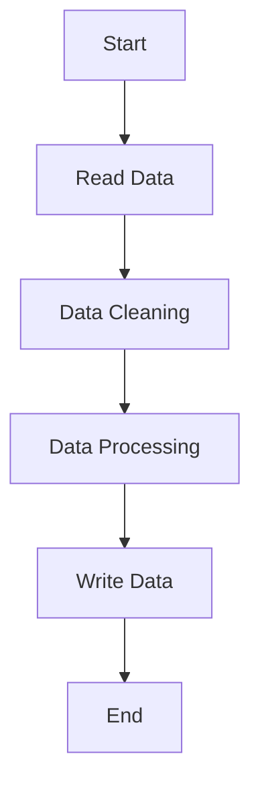

# Students Performance Analysis Project

## Overview

This project leverages Apache Spark to analyze a dataset detailing students' performance across various subjects. The goal is to calculate each student's overall percentage, assign grades, and determine their pass or fail status. This README aims to provide a clear understanding of the project's purpose, the technologies used, and the solution approach, making it accessible to audiences of all levels.

## Table of Contents

- [Overview](#overview)
- [Problem Statement](#problem-statement)
- [Why Spark and Big Data?](#why-spark-and-big-data)
- [Technologies Used](#technologies-used)
  - [Apache Spark](#apache-spark)
  - [Hadoop](#hadoop)
  - [PySpark vs. Scala](#pyspark-vs-scala)
- [Solution Approach](#solution-approach)
- [Project Structure](#project-structure)
- [Flowchart](#flowchart)
- [Key Learnings](#key-learnings)
- [Conclusion](#conclusion)

## Problem Statement

The dataset contains students' scores in mathematics, reading, and writing, alongside demographic information. The challenge is to process this data to calculate each student's total percentage, assign a grade based on their performance, and finally determine their overall result (pass or fail).

## Why Spark and Big Data?

### Apache Spark

Apache Spark is a unified analytics engine for large-scale data processing. It provides an interface for programming entire clusters with implicit data parallelism and fault tolerance. Spark is chosen for its speed, ease of use, and compatibility with the Hadoop ecosystem.

### Hadoop

Hadoop is a framework that allows for the distributed processing of large data sets across clusters of computers using simple programming models. It is designed to scale up from single servers to thousands of machines, each offering local computation and storage.

### PySpark vs. Scala

- **PySpark**: PySpark is the Python API for Spark, bringing the simplicity and versatility of Python to Spark's powerful data processing capabilities. It's popular in data science and analytics for its ease of use and the extensive ecosystem of Python libraries.
- **Scala**: Scala, on the other hand, is Spark's native language. It can offer better performance due to JVM optimization and is a good choice for projects requiring maximum efficiency.

## Technologies Used

- **Apache Spark**: For processing large datasets efficiently.
- **Hadoop**: For storing datasets across a distributed environment.
- **Python/PySpark**: For writing Spark applications in Python.

## Solution Approach

The solution is structured into several key functions, each designed to perform specific tasks in the data processing pipeline:

1. **Data Loading**: Reading the input CSV file into a Spark DataFrame.
2. **Data Cleaning**: Dropping rows with null values to ensure data quality.
3. **Data Processing**:
   - Calculating the total percentage for each student.
   - Assigning grades based on the calculated percentage.
   - Determining the pass/fail status.
4. **Data Output**: Writing the processed data to a CSV file, ensuring it's stored as a single partition with headers.

## Project Structure

The project is organized into the following main functions:

- `read_data()`: Loads the CSV file into a DataFrame.
- `load_data()`: Writes the DataFrame to a CSV file.
- `result_1()`, `result_2()`, `result_3()`: Perform various data processing tasks.

## Flowchart

## Key Learnings

- **Efficiency of Spark**: The project demonstrates Spark's ability to handle large datasets efficiently, showcasing its power in big data processing.
- **Modularity**: Structuring the solution into distinct functions for each step of the data processing pipeline enhances code readability and maintainability.
- **Practical Application**: This project serves as a practical example of applying big data technologies to solve real-world problems.

## Conclusion

This project showcases the application of Apache Spark and big data technologies to analyze and derive insights from students' performance data. Through this project, we've demonstrated the power of Spark in processing large datasets, the importance of a well-structured data processing pipeline, and the practical implications of big data technologies in solving real-world problems.